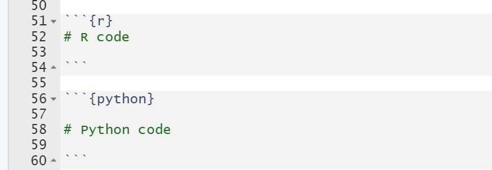

```{r setup, include=FALSE}
knitr::opts_chunk$set(echo = FALSE)
```

> ##### Before going through this article, you should have some basic knowledge of R programming, Python programming(Pandas), R Studio and R markdown.

There is always a perennial debate on which programming language is better. Both languages, R and Python, have their own communities and support groups. None of them are wrong. Both R and Python languages have their own pros and cons and each language is better suited for different scenarios. Rather than debating on which language is better, in my opinion, we should try to incorporate both languages in our work. And **Reticulate** package in R helps to incorporate Python codes in R. Similar kinds of libraries(rpy2) are available in Python to incorporate R codes in Python.

The goal of this article is to get you started with the basic interaction between R and Python dataframes using **Rmarkdown** and **Reticulate** package.
In this article, we are going to cover the following things.

-   What is reticulate?
-   Installation and setup for this demo
-   Loading library and setting conda
-   Using python code to import a csv file
-   Adding a new column in dataframe
-   Source Python code or File
-   Convert dataframe in R to Python dataframe
-   Interactive graphs in R with python dataframe

---

## What is reticulate?

Reticulate is an R package that can assist us to interact between R and Python. It is a bridge between R and Python.

---

## Installation and setup for this demo {#installation-and-setup-for-this-demo}


Let's get started. Firstly, you need to install Reticulate package ([Installation and setup](https://rstudio.github.io/reticulate/))and then install Pandas ([Installing python packages](https://rstudio.github.io/reticulate/articles/python_packages.html)) for this short demo.

In your console, execute:

**install.packages("reticulate")** and then

**reticulate::conda_install("r-reticulate", "pandas")**

> Rmarkdown can execute both R and Python codes. You can write both R and Python codes in their respective code chunks:



---

## Loading library and setting conda.

Lets load the library(**reticulate**) and set the path to a 'conda' executable. In this case, appropriate 'conda' is automatically set. To know more, execute **?reticulate** and **?conda_python** in your R console.

```{r echo=TRUE}
#R code

library(reticulate) #<<
conda_python()      #<<

```

It by default sets the version of Python found on your path. But you can also [set the path to your desired python version](https://rstudio.github.io/reticulate/reference/use_python.html).

---

## Using python code to import a csv file.

Copy the path in the link [cars.csv](https://github.com/sanjayhamal/Files-for-you/blob/main/cars.csv) to provide path to your csv file. 

```{python echo=TRUE}
#Python code

import pandas as pd
car_python = pd.read_csv("cars.csv")
car_python.head(n=10)

```
---

## Adding a new column in dataframe.

> Let's add a new column->"Speed_category" in our dataframe using pandas. 
- If the speed is less than 10 and greater than zero, label it as "Low speed".
- If the speed is between 10 and 20, label it as "Medium speed"
- Label the rest as "High speed". We will use this column later to create a 3D graph.

```{python echo=TRUE}

#Python code

car_python["Speed_category"]= ""

for i in range(len(car_python)):
  if car_python.loc[i, "speed"]>0 and car_python.loc[i,"speed"]<=10:
    car_python.loc[i, "Speed_category"]= "Low speed"
  elif car_python.loc[i, "speed"]>10 and car_python.loc[i, "speed"]<20:
    car_python.loc[i, "Speed_category"]= "Medium speed"  
  else:
    car_python.loc[i, "Speed_category"]= "High speed"

car_python.head(n=10)

```

---

## Converting dataframes in python to R
> Use py$: 

Here, **car_python** is a variable in python that stores a dataframe, which in the code below, is used by R and stored as a dataframe in an R variable, **R_cars**.


```{r echo=TRUE}
#R code

R_cars<- py$car_python 

head(R_cars, n=4)
```

---

## Source Python code or File

A python file, [time.py](https://github.com/sanjayhamal/Files-for-you/blob/main/time.py) contains the following python function to convert speed and distance to time. Download it. In the next step, we will see how to use the **time(dist, speed)** function from "time.py" file to our R code :

```{python echo=TRUE}
# time.py 
def time(DIST, SPEED):
  return DIST/SPEED
```


>Use source_python("Path to your python file") and use the python functions directly to your R code.

```{r echo=TRUE}
#R code

source_python("time.py")

for(i in seq(nrow(R_cars))){
  
  R_cars[i, "Time"]= 
    time(R_cars[i, "dist"], R_cars[i, "speed"])
  
}

head(R_cars)

```


## Convert dataframe in R to Python dataframe.

> Use 'r.' .

In the code below, **R_cars** is a variable in R which is called in a python code and converted to python dataframe and stored in a variable, **python_cars2**.

```{python echo=TRUE}
#Python code

python_cars2 = r.R_cars   

python_cars2.head(n=5)

```

## Interactive graph in R with python dataframe

>Here, we are creating a scatter plot, line plot and a regression plot combined using a python dataframe,"python_cars2" in R code.  -ggplot creates visually appealing graphs in R and ggplotly() function converts ggplot graphs to interactive ones.

```{r echo=TRUE, message=FALSE, warning=FALSE}
#R code

library(ggplot2)
library(plotly)

my_plt<- ggplot(data = py$python_cars2,
                aes(speed, dist))+
  geom_point(aes( color= Speed_category, shape= Speed_category))+
  geom_line(color= 'orange', alpha=0.5, linetype='dashed')+
  geom_smooth(se= F, color='red')


my_plt %>% ggplotly()

```

> 3D plots using plotly and python dataframe.

```{r echo=TRUE}
# R code

my_plot3<-plot_ly(data = py$python_cars2,
                  x=~speed,
                  y=~dist,
                  z=~Time) %>% 
  add_markers(color= ~Speed_category)

my_plot3
```

---

To recapitulate, we learned about Reticulate and also viewed a short demonstration about interoperability between R and Python using the **Reticulate** package.

>To learn more about Reticulate package, visit  [Reticulate](https://rstudio.github.io/reticulate/).


